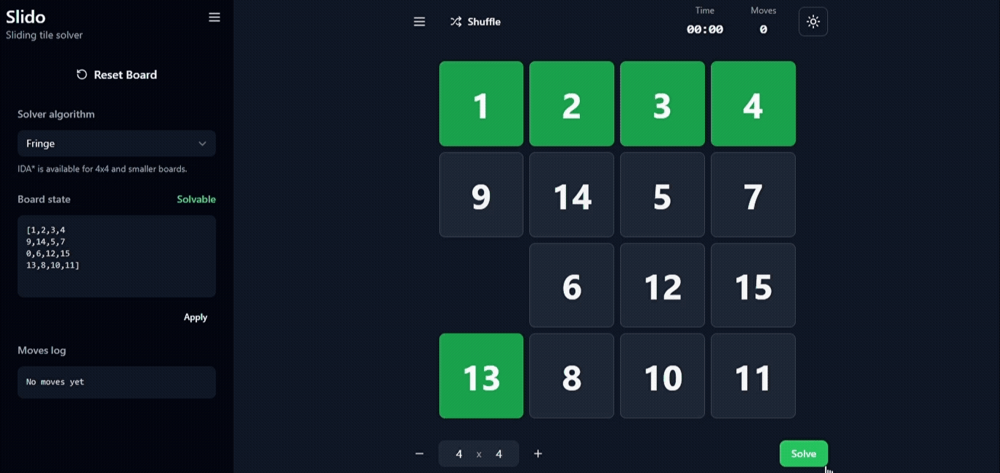
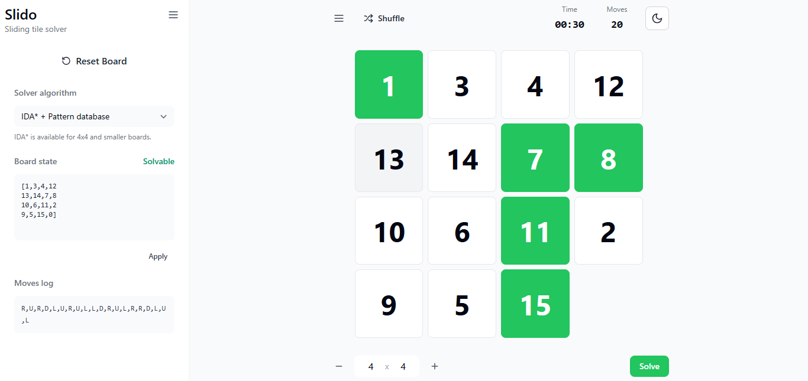
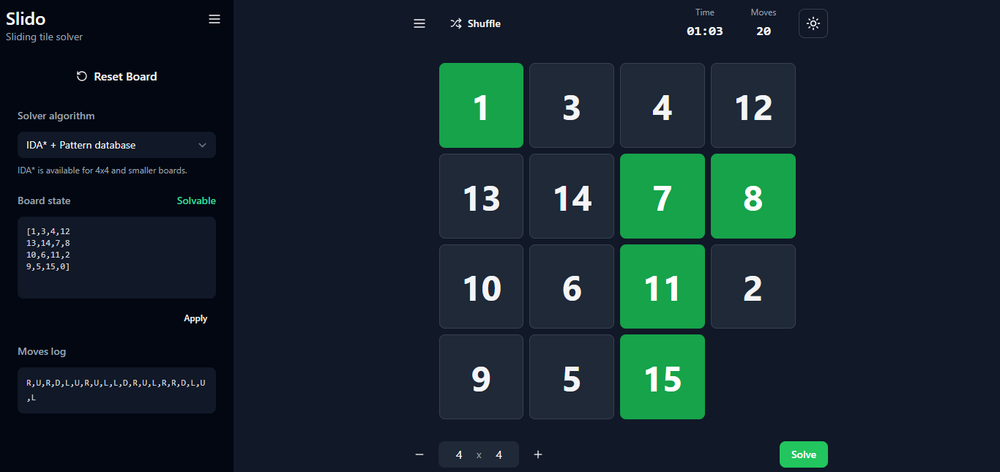
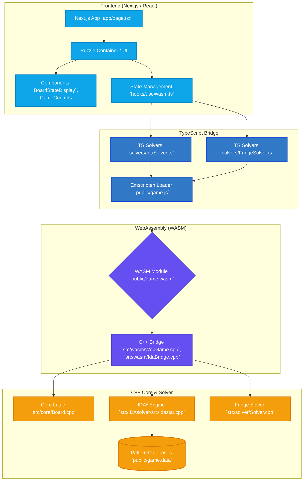

<div align="center">
  

  <h1>Sliding Tile Puzzle </h1>

  <p>
    <strong>A high-performance sliding tile puzzle web app featuring an intelligent auto-solver.</strong><br>
    <em>Pushing the limits of the LearnCPP Chapter 21 project by combining a Next.js frontend with a C++ search engine compiled to WebAssembly.</em>
  </p>

  <a href="https://slidingtilepuzzle.vercel.app/">
    
  </a>
  <a href="https://nextjs.org/">
    
  </a>
  <a href="https://isocpp.org/">
    
  </a>
  <a href="https://webassembly.org/">
    
  </a>
  <a href="LICENSE">
    
  </a>
</div>

<br />

## The Proof

Watch the engine compute the optimal path and animate the solution directly in the browser.

<div align="center">
  
</div>
<br />
<div align="center">
  
  
</div>

## The Problem

The standard 15-puzzle has **10,461,394,944,000** solvable states. Calculating optimal paths through this state space using standard JavaScript causes severe UI blocking and browser timeouts. 

This project solves the computational bottleneck by offloading advanced heuristic algorithms (IDA* with disjoint pattern databases) to a **C++ engine compiled to WebAssembly**, enabling instantaneous, non-blocking puzzle solving within a modern React application.

## Core Features

* **Dynamic Grid Sizes:** Generate square or rectangular boards from `2x2` up to `10x10`.
* **Custom Board State Validation:** Input custom puzzle states manually. The engine calculates parity to determine if the board is mathematically solvable before attempting a search.
* **Intelligent Auto-Solver:** Executes advanced heuristic searches (IDA* and Fringe) to find optimal solution paths.
* **Move Logging:** Tracks and logs every manual user move and automated solver step.

---

## Technical Architecture & Bounds

### Data Flow



### Algorithm Matrix & System Bounds

To respect browser memory constraints, the system dynamically selects the most appropriate solver algorithm based on the board dimensions.

| Grid Size | Recommended Solver | Memory/Payload Impact | Rationale |
| :--- | :--- | :--- | :--- |
| <**4x4** | IDA* + Disjoint Pattern DB | ~2.85 MB (`game.data`) | The 15-puzzle state space requires pre-computed disjoint pattern databases (`.dat` files) for optimal solutions within acceptable timeframes. |
| **≥ 5x5** | Fringe Search | Minimal | The mathematical explosion of a 5x5+ grid exceeds browser memory for pattern databases. The system safely falls back to a low-memory Fringe Search. |

> **Payload Profile:** The core Wasm execution module (`game.wasm`) is incredibly lightweight at **~221.5 KB**. The pattern databases (`game.data`) weigh **~2.85 MB**, which are asynchronously loaded by the Emscripten runtime.

### Clean Developer Experience

The complexity of the C++ bridge is completely abstracted from the React layer using a custom `useWasm` hook:

```typescript
// Example usage within a React component
const { solve, isSolving } = useWasm();

const handleSolveClick = async (boardState) => {
  // Passes the React state to C++, receives an array of optimal moves
  const optimalMoves = await solve(boardState); 
  animateTiles(optimalMoves);
};
```

---

## Quick Start & Local Development

The setup is separated into frontend execution and backend Wasm compilation to accommodate both UI developers and systems engineers.

### Prerequisites
* **[Node.js](https://nodejs.org/)** (v18+ recommended)
* **[Emscripten `v5.0.7`](https://emscripten.org/)** (Required *only* if you intend to modify the C++ source files).

### 1. Frontend Setup

Clone the repository and install dependencies:
```bash
git clone [https://github.com/Chitlangia-Vedant/Sliding-Tile-Puzzle.git](https://github.com/Chitlangia-Vedant/Sliding-Tile-Puzzle.git)
cd Sliding-Tile-Puzzle
npm install
```

### 2. Configuration
Copy the template environment file:
```bash
cp .env.example .env.local
```
This sets standard paths like `NEXT_PUBLIC_WASM_PATH=/game.js`. No external API keys are required.

### 3. Start the Development Server
```bash
npm run dev
```
Navigate to `http://localhost:3000`.

<details>
<summary><b>C++ / WebAssembly Compilation (Advanced)</b></summary>

If you modify the algorithms in `src/IDAsolver` or `src/core`, you must recompile the WebAssembly binaries.

1. Ensure Emscripten `v5.0.7` is installed and activated (`emsdk activate 5.0.7`).
2. Run the included Makefile from the project root:
   ```bash
   make
   ```
This updates `public/game.wasm`, `public/game.js`, and packages the `.dat` files into `public/game.data`.
</details>

---

## Project Structure

```text
Sliding-Tile-Puzzle/
├── app/                  # Next.js App Router (Pages, Layouts, CSS)
├── components/           # React UI Components (Board, Controls, Logs)
├── hooks/                # Custom React Hooks (useWasm.ts)
├── lib/                  # TypeScript Types & Configurations
├── public/               # Static Assets & Compiled Wasm (game.js, game.wasm, game.data)
├── solvers/              # TypeScript bridges to the Wasm Engine
└── src/                  # C++ Core Engine
    ├── core/             # Base Board and Tile Logic
    ├── IDAsolver/        # IDA* Search Algorithm & Pattern Databases
    └── wasm/             # Emscripten Bindings (IdaBridge.cpp)
```

---

## Roadmap

- [ ] **Global Leaderboards:** Track fastest solve times and lowest move counts.
- [ ] **Hover-on Control:** Implement "no-click" mouse inputs for faster manual solving (inspired by [ske7/15-Puzzle](https://github.com/ske7/15-Puzzle)).

---

## Contributing

While I am not actively recruiting maintainers, pull requests for UI improvements, new heuristic algorithms, or Wasm optimizations are always welcome! 

1. Fork the Project
2. Create your Feature Branch (`git checkout -b feature/AmazingFeature`)
3. Commit your Changes (`git commit -m 'Add some AmazingFeature'`)
4. Push to the Branch (`git push origin feature/AmazingFeature`)
5. Open a Pull Request

---

## Acknowledgements & References

This project builds upon the research, algorithms, and tutorials of the following creators. *Note: A modified version of the IDA\* + database solver code from Michael Kim is utilized in this implementation.*

* **[LearnCPP Chapter 21](https://www.learncpp.com/cpp-tutorial/chapter-21-project/)** - The original C++ console project that inspired this web port.
* **Michael Kim** - [Solving the 15 Puzzle (Blog)](https://michael.kim/blog/puzzle) | [15puzzle GitHub](https://github.com/MichaelKim/15puzzle)
* **Luke LaValva** - [Theory of Sliding](https://www.lukelavalva.com/theoryofsliding)
* **Vladyslav Cherednichenko (iCherya)** - [Sliding Puzzle Game](https://icherya.github.io/Fifteen-Puzzle/)

---

## License

This project is open-source and available under the [MIT License](LICENSE). Copyright (c) 2026 Vedant Chitlangia.